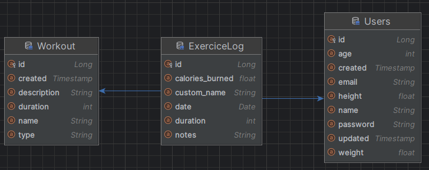

# Template
Starter template for microservice api using springboot and a postgres database. Using the standard architectural pattern(Controller,Service,Repository)
to easily employ the deployment of JPA object mapping. This will stay in a unfinish state as it is only used as a tamplate for future project that I would
like to do.

# Set up
- in pom.xml add dependency if using another DB or other standard springboot plugins.
- in application.properties change the properties depending on what plugins you are usings.
- Don't forget to use the right drivers for your DB.
- Modify Config.CustomConfiguration to add data at the start.
- Will most likely run on localhost:8080

# Exemple

Workout <- ManyToOne <- ExerciceLog -> ManyToOne -> user